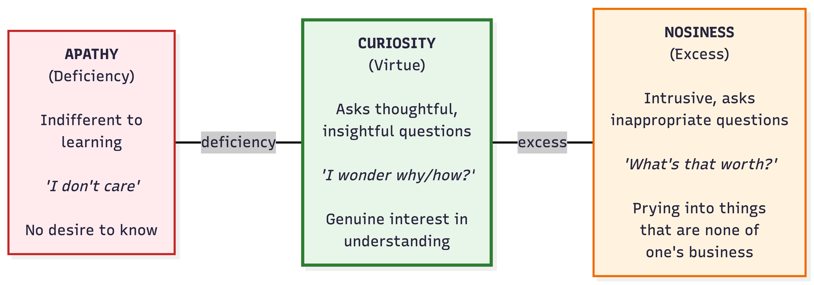
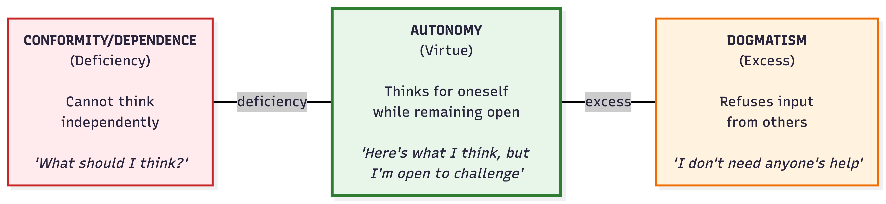

# Deficiency / Virtue / Excess

**Understanding Intellectual Virtues Through Balance**

Intellectual virtues exist on a spectrum. This framework, rooted in Aristotelian virtue ethics, helps us understand that virtues represent a balanced middle ground between two extremes: deficiency (too little) and excess (too much).

## LEARNING INITIATORS

### Curiosity

**Apathy (Deficiency)**

- Shows no interest in learning or understanding
- Asks no questions, even when confused
- Treats learning as a chore
- "Whatever, I don't really care"

Example: A student who never wonders about anything beyond what's required for a grade

**Curiosity (Virtue)**

- Asks thoughtful, well-timed questions
- Driven by genuine desire to understand
- Knows when to stop asking questions
- Pursues worthwhile subjects, not trivial matters

Example: A learner who asks "Why does this work this way?" and follows up with deeper questions

**Nosiness (Excess)**

- Asks questions that invade privacy or boundaries
- Pursues trivial or salacious information
- Questions relentlessly without regard for context
- Driven by gossip rather than genuine understanding

Example: Someone who constantly asks "How much did that cost?" or pries into personal matters

### Autonomy

                                   

**Conformity/Dependence (Deficiency)**

- Cannot form independent judgments
- Simply mirrors others' beliefs
- Constantly asks "What should I think about this?"
- Lacks confidence in own reasoning

Example: A person who changes their opinion based on whoever spoke last

**Autonomy (Virtue)**

- Forms own judgments and conclusions
- Uses evidence and reasoning independently
- Remains appropriately responsive to expert guidance
- Balances independence with openness to input

Example: A thinker who develops their own perspective but welcomes critique and evidence

**Dogmatism (Excess)**

- Refuses to consider others' input or expertise
- Overly confident in own reasoning
- Believes they can figure everything out alone
- Dismisses legitimate authority or expertise

Example: Someone who rejects expert scientific consensus because "I've done my own research"

### Humility

                              

**Arrogance (Deficiency)**

- Refuses to admit limitations or mistakes
- Defensive when errors are pointed out
- Believes oneself intellectually superior
- Obsessed with appearing smart

Example: A person who can never say "I don't know" and makes up answers instead

**Humility (Virtue)**

- Aware of and accepts own intellectual limitations
- Admits mistakes without shame
- Open to learning from others
- Neither hides nor obsesses over limitations

Example: A learner who can say "I made a mistake there, thanks for pointing it out"

**Servility/Self-Denigration (Excess)**

- Constantly focuses on own limitations
- Assumes oneself less capable than one is
- Defers excessively to others
- "I'm not smart enough to understand this"

Example: A competent student who constantly says "I'm terrible at this" despite evidence otherwise

## LEARNING MAINTAINERS

### Attentiveness

**Distraction (Deficiency)**

- Mind constantly wanders
- Not mentally present during learning
- Easily pulled away by any distraction
- Misses important details and connections

Example: A student who can't recall what was just discussed because they were thinking about other things

**Attentiveness (Virtue)**

- Mentally present and focused
- Notices important details
- Can concentrate on essential matters
- Knows when to shift attention appropriately

Example: A learner who is fully engaged in the moment, notices subtle patterns and connections

**Hyper-vigilance/Obsessiveness (Excess)**

- Cannot stop focusing on a single thing
- Notices everything, unable to filter what's important
- Gets stuck on irrelevant details
- Paralyzed by overthinking

Example: Someone who fixates on one minor error and can't move forward with their work

### Carefulness

**Carelessness (Deficiency)**

- Makes avoidable errors through sloppiness
- Doesn't check work for mistakes
- Rushes to conclusions
- "Good enough" mentality without pursuing accuracy

Example: A student who submits work without proofreading, filled with obvious errors

**Carefulness (Virtue)**

- Strives for accuracy and precision
- Checks work for errors
- Avoids hasty conclusions
- Gets things right without becoming paralyzed

Example: A thinker who reviews their reasoning carefully but knows when work is ready

**Scrupulosity/Perfectionism (Excess)**

- Obsesses over potential errors
- Never satisfied that work is "good enough"
- Paralyzed by fear of making mistakes
- Procrastinates due to perfectionism

Example: Someone who rewrites the same paragraph 20 times and never completes their project

### Thoroughness

**Superficiality (Deficiency)**

- Satisfied with surface-level understanding
- Doesn't probe for deeper meaning
- Fails to make connections between ideas
- Cannot explain what they claim to know

Example: A "mere regurgitator" who can repeat facts but can't explain them

**Thoroughness (Virtue)**

- Investigates topics in depth
- Explores connections between ideas
- Seeks comprehensive understanding
- Can explain clearly in multiple ways

Example: A learner who doesn't just know the formula but understands why it works

**Pedantry (Excess)**

- Insists on exhaustive detail in inappropriate contexts
- Cannot distinguish important from trivial points
- Bogs down in minutiae
- Makes simple things unnecessarily complex

Example: Someone who interrupts every conversation with "Well, actually..." and obscure trivia

## OBSTACLE OVERCOMERS

### Open-mindedness

**Closed-Mindedness (Deficiency)**

- Refuses to consider alternative viewpoints
- Rigid, inflexible thinking
- Dismisses opposing views without consideration
- "I've made up my mind, don't confuse me with facts"

Example: Someone who won't even listen to perspectives that differ from their own

**Open-Mindedness (Virtue)**

- Willing to consider alternative perspectives fairly
- Can switch viewpoints while maintaining own convictions
- Gives opposing views honest hearing
- Knows when to stop considering alternatives

Example: A thinker who seriously engages with views they disagree with before deciding

**Gullibility (Excess)**

- Accepts any claim without critical evaluation
- No stable convictions
- Cannot distinguish credible from incredible sources
- Changes mind based on whoever spoke last

Example: Someone who believes every conspiracy theory they encounter because they're "open-minded"

### Courage

**Cowardice (Deficiency)**

- Paralyzed by fear in intellectual contexts
- Won't speak up even when having valuable insights
- Avoids intellectual risks at all costs
- Silenced by fear of being wrong or looking foolish

Example: A student who never raises their hand despite having thoughtful questions

**Courage (Virtue)**

- Persists in inquiry despite fear or discomfort
- Willing to ask difficult questions
- Speaks up when appropriate despite social risk
- Manages fear rather than being controlled by it

Example: Someone who shares a controversial but well-reasoned view in a hostile environment

**Recklessness (Excess)**

- No appropriate caution in intellectual matters
- Speaks without thinking
- Takes foolish intellectual risks
- Confuses recklessness with courage

Example: Someone who loudly proclaims expertise in areas they know nothing about

### Tenacity

**Laziness/Quick Quitting (Deficiency)**

- Gives up at first sign of difficulty
- No persistence through intellectual challenges
- Avoids anything requiring sustained effort
- "This is too hard, I quit"

Example: A student who abandons a problem after one failed attempt

**Tenacity (Virtue)**

- Perseveres through intellectual difficulties
- Adjusts approach when struggling
- Embraces intellectual challenges
- Knows when giving up is actually appropriate

Example: A learner who tries multiple strategies when stuck, learning from each failure

**Stubbornness (Excess)**

- Persists with failed approaches
- Won't give up even when it's clearly not working
- Cannot recognize when to move on
- Confuses tenacity with inflexibility

Example: Someone who keeps using the same failed method, refusing to try anything different

## Using These Scales in Teaching

**For Self-Reflection**

Ask students: "Where do you tend to fall on each scale? Which extremes do you lean toward?"

**For Feedback**

Instead of saying "You need more curiosity," say "I noticed you might be leaning toward intellectual apathy here—what questions might you ask?"

**For Goal-Setting**

"This semester, I'm working on moving from intellectual cowardice toward courage, while making sure I don't become reckless."

**or Normalization**

These scales show that everyone struggles—we all tend toward one extreme or another at different times. The virtue is the ongoing practice of finding balance.